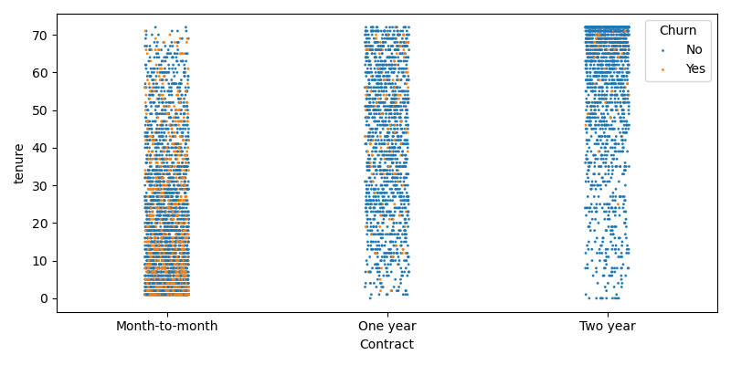
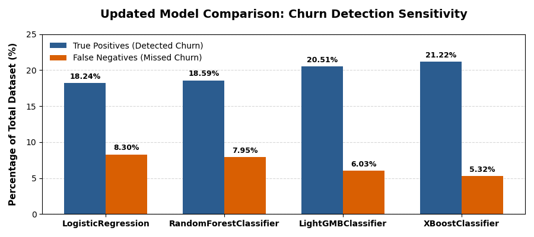

## 1. Executive Summary & Business Case

### Business Context & Problem Statement

In the highly competitive telecommunications market, customer flight—formally known as churn—represents a severe threat to sustained revenue and market share. Driven by aggressive competitor pricing and low switching costs, subscribers regularly migrate between providers. Industry benchmarks indicate that acquiring a new customer costs **five to ten times more** than retaining an existing account, shifting the corporate paradigm from aggressive customer acquisition towards proactive retention strategies.


This project tackles the **Kaggle Telco Customer Churn challenge** (url: https://www.kaggle.com/datasets/blastchar/telco-customer-churn/data), utilizing historical records from a telecommunications firm servicing **7,043 customers**. The overarching business problem is an overall **attrition rate of 26.54%**, a baseline figure that drains profitability and signals underlying friction points within specific customer segments. It has 21 features. 


### Project Objective & Scope

The core objective of this end-to-end data science solution is to transition the business from a reactive posture into an automated, preventative system. By evaluating historical account demographics, subscription structures, and product usage data, this project aims to:

1.  **Uncover Structural Risk Drivers:** Diagnose the primary operational variables (such as contract duration, payment friction, and service gaps) that correlate with customer dissatisfaction and departure.

2.  **Engineer Domain-Specific Features:** Derive high-value predictive metrics from raw billing structures to better capture the behavioral trajectory of subscribers.

3.  **Deploy a Sensitive Classifier:** Develop, optimize, and benchmark multiple machine learning architectures capable of preemptively flagging high-risk customers before they formalize service cancellation.


### Strategic Business Value

Rather than treating churn as an unpreventable operational metric, the predictive frameworks developed herein serve as a decision-support mechanism for the Customer Relationship Management (CRM) and Marketing teams. By assigning a precise churn probability score to each subscriber, the business can deploy targeted, cost-effective loyalty incentives—such as tailored contract upgrades, proactive discounts, or bundled service extensions—exclusively to high-risk individuals. This precise resource allocation minimizes marketing waste on inherently loyal customers whilst simultaneously maximizing retention across vulnerable segments, driving a direct positive impact on Customer Lifetime Value (CLTV) and corporate profitability.


## 2.- Repository Structure

├── data/

│   ├── Telco-Customer-Churn.csv

│   └── Telco-Customer-Churn_processed.csv               

├── notebooks/          

│   ├── 01_eda_feature_eingineering.ipynb

│   └── 02_modeling_evaluation.ipynb

├── figures/

├── README.md           

└── requirements.txt   

&#x20;

## 3.- Data Cleaning & Key Exploratory Data Analysis (EDA) Insights


### Data Integrity & Pre-processing

*   **Missing Values & Data Types:** Initial evaluation via `df.info()` showed zero formal null values. However, `TotalCharges` was incorrectly classified as an `object` type due to the presence of 11 blank spaces. Cross-referencing revealed these rows corresponded precisely to new customers with a `tenure` of 0. Their `TotalCharges` were logically imputed to 0, and the feature was recast to `float`.

*   **Irrelevant Features & Encoding:** The `customerID` column was dropped as it lacked predictive value. Categorical variables were structurally analyzed: binary objects will be mapped directly to 0/1 (including `SeniorCitizen`, which was already numerical), whereas multi-categorical features (3+ levels) will be processed using `OneHotEncoder`.

*   **Class Imbalance:** Target analysis confirmed that **73.46%** of the dataset represents active accounts (`Churn: No`). Consequently, reliance on *Accuracy* alone would introduce a severe baseline bias (as a dummy "No" model yields 73.46% accuracy). Evaluation metrics will strictly prioritize *Recall* and *Precision-Recall curves*.


### Demographic & Behavioural Distribution

*   **Cohort Segmentation:** Distribution plots indicate a highly bimodal customer base: a massive influx of new accounts within their first month alongside a robust, long-term loyal cohort (+60 months tenure). 

*   **Financial Profiles:** Monthly expenditures are highly concentrated under 30€, beyond which charges follow a near-normal distribution. Crucially, a distinct correlation exists between higher monthly fees and increased churn velocity; conversely, retained clients consistently exhibit lower monthly expenses.

*   **Categorical Balance:** Demographics like `gender`, or features such as `Partner`, `MultipleLines`, `StreamingTV`, and `StreamingMovies` show balanced raw distributions. The majority of the subscriber base consists of non-senior citizens under Month-to-Month contracts, with 'Electronic Check' being the dominant `PaymentMethod`.


### Primary Churn Correlations

*   **Tenure Vulnerability:** Violin plots confirm that churn density is heavily skewed towards low-tenure accounts; new subscribers frequently terminate their services within a short period.

*   **Feature Associations:** Whilst `gender` and `MultipleLines` demonstrate negligible impact on customer flight, specific risk profiles emerged: senior citizens exhibit a highly volatile 50/50 churn split, unpartnered individuals show a higher probability of departure, and Month-to-Month contracts act as the single strongest operational catalyst for customer attrition.


## 4. Feature Engineering & Correlation Analysis


To enrich the predictive capacity of the models, advanced features were engineered based on the statistical behaviors identified during EDA.


### Engineered Variables

1.  **High-Risk Segment Proxy:** Isolating the most critical attrition pocket discovered in the violin plots, a composite boolean feature was built to flag accounts concurrently holding a Month-to-Month contract, using fibre-optic internet, and displaying a tenure under 12 months.



2.  **Financial Trajectory Ratio:** Because `TotalCharges` shares a strong, natural positive correlation with `tenure` (as accumulated billing increases over time), a ratio between `MonthlyCharges` and `TotalCharges` was constructed. New subscribers display a ratio close to 1, while stable, long-term clients smoothly approach 0. Any mature account maintaining a disproportionately high ratio indicates a recent, aggressive monthly price escalation, heavily correlating with an increased probability of churn.

3.  **Service Density Metric:** Data exploration proved that single-service accounts are highly unstable, whereas multi-service subscribers demonstrate superior loyalty. A discrete metric summing the total number of active, contracted services per user was implemented to serve as an overall engagement proxy.


### Data Leakage Safeguards

A rigorous review of the feature pipeline was conducted to guarantee model validity. All engineered variables and raw feature states are computed exclusively using information available *prior* to the formal churn event statement. Consequently, data leakage risks are entirely mitigated, ensuring the framework remains stable and valid for real-world deployment.


## 5. Machine Learning Modelling & Evaluation


The predictive framework was constructed using a highly disciplined machine learning pipeline designed to prevent data leakage and robustly handle the dataset's structural class imbalance.


### 1. Feature Pre-processing & Pipeline Architecture

Data transformations were isolated inside an automated Scikit-Learn `Pipeline` and managed via a centralized `ColumnTransformer`:

*   **Numerical Features:** Imputed using `SimpleImputer` and scaled using `StandardScaler` to ensure distance-based models evaluate constraints equitably.

*   **Binary Categorical Features:** Encoded directly into 0/1 binary states.

*   **Multi-Categorical Features (3+ levels):** Dynamically expanded into sparse matrices using `OneHotEncoder`.


### 2. Model Training & Hyperparameter Optimization

Four distinct algorithmic architectures were selected for benchmarking: **Logistic Regression**, **Random Forest Classifier**, **LightGBM Classifier**, and **XGBoost Classifier**. 

To ensure generalizability, hyperparameter tuning was conducted using `RandomizedSearchCV` paired with a **5-fold `StratifiedKFold` cross-validation** strategy, guaranteeing that each validation fold accurately reflected the baseline 26.54% churn prevalence. Optimization strictly targeted the Precision-Recall Area Under the Curve (**PR-AUC** / `average_precision`) to mitigate the inherent evaluation bias of class imbalance.


### 3. Threshold Calibration via Precision-Recall Curve

Rather than relying on the standard 0.5 default decision threshold—which often underperforms on imbalanced datasets—the initial probability predictions for the test set were extracted. By plotting the `PrecisionRecallDisplay`, the decision threshold for each classifier was calibrated to target the point that **maximized the F1-score**. 


Predictions were then systematically re-computed across the test set using these newly optimized thresholds, and comprehensive `classification_report` frameworks were generated to evaluate the real-world operational changes.


### 4. Final Benchmarking & Performance Analytics

The updated models were benchmarked by compiling their accuracy scores, recall rates, custom ROC curves, and dynamic Precision-Recall distributions into a centralized summary framework. The final confusion matrices (expressed in percentages of the total dataset) yielded the following performance metrics:


| Model | Accuracy | True Negatives (No Churn) | False Positives (Type I Error) | False Negatives (Type II Error) | True Positives (Churned) | Recall (Positive Class) |
|:-------:|:---------:|:----------:|:--------:|:---------:|:---------:|:---------:|
| **Logistic Regression** | **80.91%** | **62.67%** | 10.79% | 8.30% | 18.24% | 69.00% |
| **Random Forest Classifier** | 80.20% | 61.60% | 11.85% | 7.95% | 18.59% | 70.00% |
| **LightGBM Classifier** | 78.00% | 57.49% | 15.97% | 6.03% | 20.51% | 77.00% |
| **XGBoost Classifier** | 76.72% | 55.50% | **17.96%** | **5.32%** | **21.22%** | **80.00%** |


*(Note: The comparative visual graph displaying Churn Detection Sensitivity is embedded below for direct model evaluation).*





### 5. Strategic Business Trade-offs & Conclusions

*   **XGBoost (Maximum Sensitivity & Risk Mitigation):** The XGBoost classifier delivers the most powerful performance regarding churn identification, achieving an outstanding **80.00% Recall**. It minimizes False Negatives to just **5.32%**, meaning it successfully captures **21.22%** out of the total 26.54% of churning customers. This model represents the optimal choice if the primary business mandate is to prevent customer flight at all costs, despite incurring an **17.96% False Positive rate** that may cause unnecessary retention marketing expenditure on loyal clients.

*   **Logistic Regression (High Precision & Cost Efficiency):** In direct contrast, Logistic Regression yields the highest overall accuracy (**80.91%**) and the lowest False Positive rate (**10.79%**). This model is highly conservative and exceptionally cost-efficient, making it ideal if the budget for retention campaigns is strictly limited, as it prevents wasting resources on customers who have no intention of leaving, at the expense of a higher rate of missed churners (False Negatives at **8.30%**).

*   **Random Forest and LightGBM (Intermediate Solutions):** Random Forest performs comparably to Logistic Regression but with slightly lower accuracy, while LightGBM shifts to a high-recall posture (**77.00%**), acting as a well-balanced bridge between both operational approaches.


### 6.- HOW TO RUN & REPRODUCE

#### 1. Clone the Repository

Clone the project architecture to your local environment using git:

```bash

git clone https://github.com

cd telco-churn-prediction

```


#### 2. Environment Setup & Dependencies

It is highly recommended to initialize a clean virtual environment (`venv` or `conda`) before installing the required project dependencies.


Create and activate a virtual environment:

```bash

# For macOS/Linux:

python3 -m venv venv

source venv/bin/activate


# For Windows (Command Prompt):

venv\\Scripts\\activate

```


Install the exact package framework utilized in this project via `pip`:

```bash

pip install -r requirements.txt

```


#### 3. Pipeline Execution Sequence

The project execution is mapped into two independent Jupyter Notebooks inside the `notebooks/` directory. They must be executed sequentially to ensure proper data flow:


1.  **`01_eda_feature_engineering.ipynb`:** Handles the initial data auditing, structural casting (imputing the `TotalCharges` blank strings to `0`), baseline data exploration, and the development of the domain-specific engineered features (such as the *Financial Trajectory Ratio* and *Service Density Metric*).

2.  **`02_modelling_evaluation.ipynb`:** Implements the core machine learning pipeline. It utilizes Scikit-Learn's `ColumnTransformer` and `Pipeline` objects to prevent data leakage during `StratifiedKFold` cross-validation, performs hyperparameter optimization via `RandomizedSearchCV`, evaluates the classifiers on the Precision-Recall Curve (`average_precision`), and extracts global feature importance through `permutation_importance`.


---


## Appendix: Core Tech Stack Details

The comprehensive mathematical and predictive framework is built upon the following production-grade libraries (documented within `requirements.txt`):


*   **Environment & Storage:** `os`, `warnings`, `joblib` *(for model serialization)*

*   **Data Structures & Visualisation:** `pandas`, `numpy`, `matplotlib`, `seaborn`

*   **Preprocessing & Feature Pipelines:** `ColumnTransformer`, `Pipeline`, `SimpleImputer`, `StandardScaler`, `OneHotEncoder`, `FunctionTransformer`

*   **Model Selection & Tuning:** `train_test_split`, `StratifiedKFold`, `cross_validate`, `RandomizedSearchCV`

*   **Machine Learning Classifiers:** `LogisticRegression`, `RandomForestClassifier`, `XGBClassifier`, `lightgbm`

*   **Advanced Evaluation Metrics:** `precision_recall_curve`, `average_precision_score` *(PR-AUC for class imbalance)*, `confusion_matrix`, `classification_report`, `permutation_importance`
